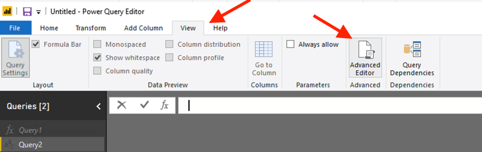

## 1. PowerBI Desktop "blank query" template
This method of connecting uses the Sesam REST API directly to retrieve JSON, starting with a blank query in PowerBI and incorporating all the necessary coding. This hard-codes the JWT authorization key and API url endpoint into the PowerBI query.

To use this template do the following:

1. Open a Power BI report. 
2. Select Get Data -> blank query:

3. Select Advanced Editor under the View tab:

4. Paste in the code from this repo, updating it with your JWT token and the URL to the dataset you wish to retrieve.
_For info about generating a JWT token, see the [Sesam API documentation](https://docs.sesam.io/api.html)

5. Press Done and start working with the data!