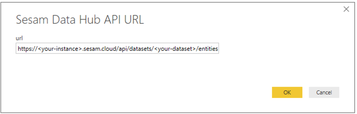
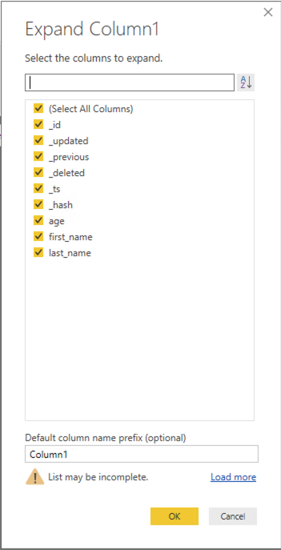

## 2. Power BI Desktop Sesam Connector (Beta)
This method of connecting uses the Sesam Power BI Connector which handles the Sesam REST API to retrieve data sets from the data hub. It provides parameterised input for the API URL and the JWT authentication key.

To install and use the connector do the following:

1. Create a new folder on your machine where Power BI is installed. It should be in the Documents folder under your own user with the path:

        \Documents\Power BI Desktop\Custom Connectors

2. Copy the Sesam.mez file from this repository to the new directory

3. Start Power BI and update security settings for custom connectors:
    * Select File -> Options and settings -> Options
    * Select Global -> Security
    * Under Data Extensions select "Allow any extension to load without validation or warning

    

4. Restart Power BI Desktop

5. Select Get Data and select Sesam:

    

6. Enter URL to the dataset you wish to import:

    

    * replace \<your-instance\> and \<your-dataset\> with appropriate values from Sesam

7. You will now need to setup the Account key to authorize access to Sesam
    * Instructions for setting up and obtaining a JWT token which can be used as the Power BI Account key is available in the Sesam documentation: 

      [Service API Documentation](https://docs.sesam.io/api.html)
    * Once obtained you can paste it into the dialog box in Power BI and apply it to the root URL. Power BI will then store the key for future use with all datasets the token is authorised to access.

8. Once the above steps are complete, Power BI should connect successfully to Sesam and pull the dataset. You can start to work with the data.

    To begin: 
    1. Click Edit
    2. Under the Transform tab, in the Structure Column section, click "Expand"
    3. Select the columns you with to use. The _ prefixed columns are Sesam internal fields.

      
      
      
  
  You can then complete other manipulations of the dataset as needed.
